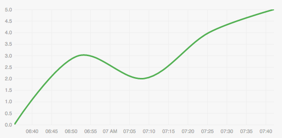
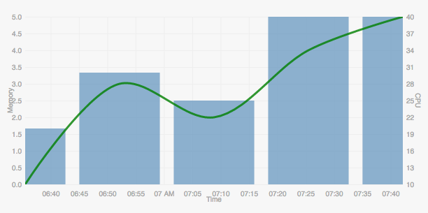

[](https://circleci.com/gh/absingla/contrail-charts)
[](http://standardjs.com/)
[//]: # ([](https://travis-ci.org/absingla/contrail-charts))

# Contrail Charts

A chart library in MVC using D3

# Installation

simply do
```
npm install contrail-charts
```
Alternatively, you can clone this repo and
```
npm install
```
To build
```
npm run build
```
to build examples, use
```
npm run build-examples
```

you'll find the `js` and `css` under `build/` directory

Or, download from our releases.

# Demo
Let's dive in and create some charts!

when contrail-charts is included via script tag, you can use coCharts from window.
Our library also supports including via requirejs. Refer our examples for samples

Let's assume we've a time-series data
```javascript
     // CPU-MEM Time series data.
     const tsData = [
       { ts: 1475760930000, mem: 0, cpu: 10 },
       { ts: 1475761930000, mem: 3, cpu: 20 },
       { ts: 1475762930000, mem: 2, cpu: 15 },
       { ts: 1475763930000, mem: 4, cpu: 30 },
       { ts: 1475764930000, mem: 5, cpu: 40 }
     ]
```
And we need to plot a line chart for memory 'mem' data over time 'ts'

```javascript
    // Initialize a XYChartView
    const cpuMemChartView = new coCharts.charts.XYChartView()

    // Let's set the chart config.
    cpuMemChartView.setConfig({
        container: '#cpumemChart', // Chart container.
        components: [ // Array of child components.
          {
            type: 'CompositeYChart', // Component type. Let's use composite-y component to render line chart. Refer wiki for more details on component.
            config: {
              plot: {
                x: {
                  accessor: 'ts', // Accessor key from dataset to plot x axis
                  label: 'Time', // Label to be displayed
                  axis: 'x'
                },
                y: [ // Array of plottable accessors on Y axis
                  {
                    accessor: 'mem', // Accessor key from the dataset.
                    chart: 'LineChart' // Type of the chart
                  }
                ]
              }
            }
          }
        ]
    })

    // Set the time series data to chart view.
    // This will trigger render function also
    cpuMemChartView.setData(tsData)
```



Nice, but the axis is missing. Let's add it. Update the config with axis

```javascript
    axis: {
        y1: {
           position: 'left'
        }
    }
```
and use them inside your plot.y config
```javascript
    ...
    y: [
      {
        accessor: 'mem', // Field name to use on y
        label: 'Memory',
        chart: 'LineChart', // Type of the chart
        axis: y1 // Axis to plot this field on
      }
    ]
    ...
```

Let's make it more interesting. Add cpu data also in the same chart, but let's use bar chart for cpu data and since two 
series are different, let's put them on different axis.

```javascript
    ....
    // Add new axis.
    axis: {
            y1: {
                position: 'left'
            },
            y2: {
                position: 'right'
            }
        }

    ...
    // Update the Y accessors.
    y: [
      {
        accessor: 'mem', // Field name to use on y
        chart: 'LineChart', // Type of the chart
        label: 'Memory', // Label to be displayed on the axis
        axis: y1 // Axis to plot this field on
      },
      {
          accessor: 'cpu', // Field name to use on y
          chart: 'BarChart', // Type of the chart
          label: 'CPU', // Label to be displayed on the axis
          axis: y2 // Axis to plot this field on
        }

    ]
    ...
```



Using the same XYChartView we can render line, bar and zoom charts. Head over to examples for more!

Refer [Documentation](https://github.com/Juniper/contrail-charts/wiki) for different types of charts, components and 
their config options. 

# Tests

To run UT,

```npm run test```

under CI infrastructure, we use phantomjs. If you want to run under headless browser
`npm install -g phantomjs-prebuilt` and do `npm run test-headless`
